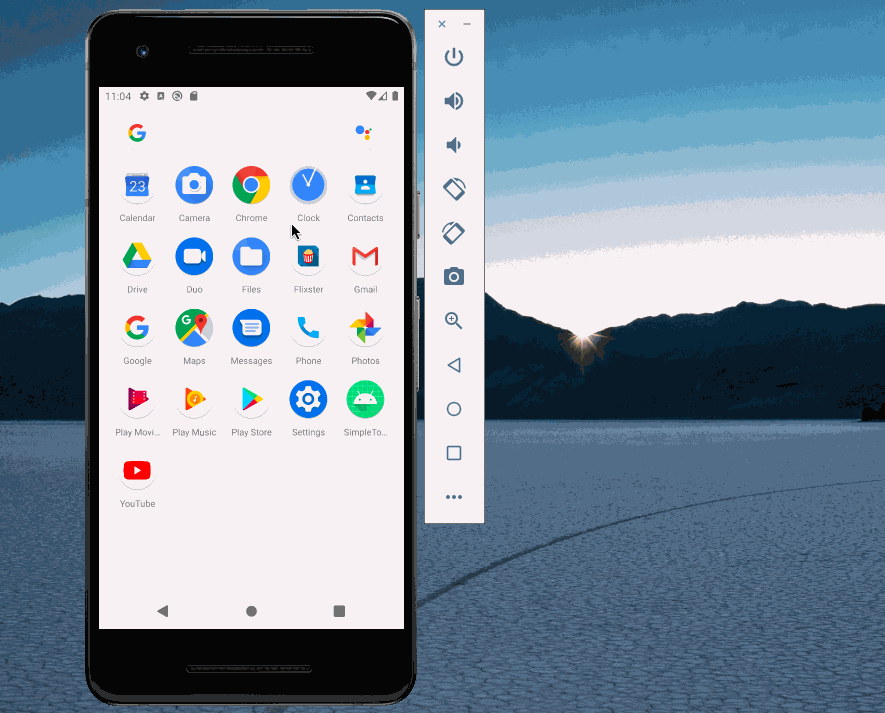

# Flixster

**Flix Part 1** 

Submitted by: **Rupinder Kaur**

Time spent: **5** hours spent in total

## User Stories

The following **required** functionality is completed:

* [x] User can view a list of movies (title, poster image, and overview) currently playing in theaters from the Movie Database API.

The following **bonus** functionality is completed:

* [x] Views should be responsive for both **landscape/portrait mode.
* [x] In portrait mode, the poster image, title, and movie overview is shown.
* [x] In landscape mode, the rotated alternate layout should use the backdrop image instead and show the title and movie overview to the right of it.

The following **additional** features are implemented:

* [x] Improved the user interface by experimenting with styling and coloring.
* [x] Chnaged app icon and color of title bar

## Video Walkthrough

Here's a walkthrough :

 

