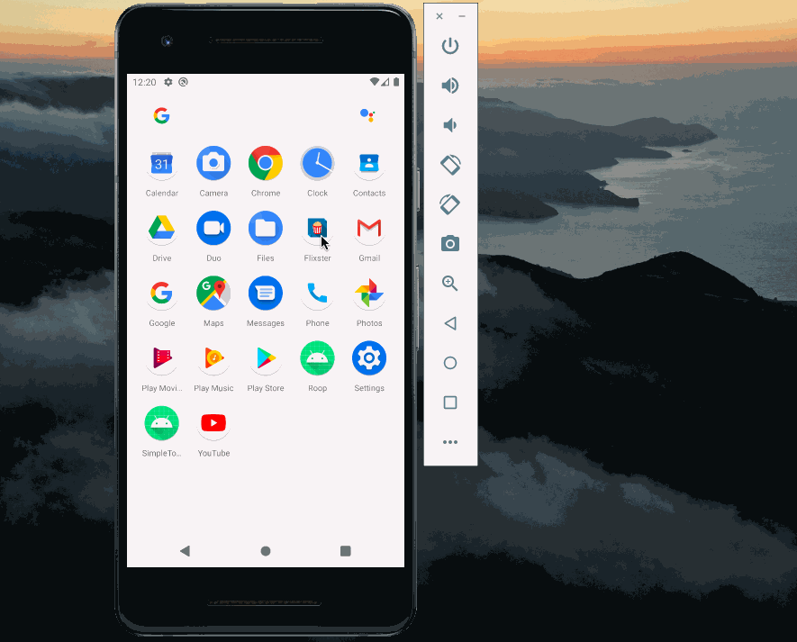

# Flixster

**Flix Part 1** 

Submitted by: **Rupinder Kaur**

Time spent: **5** hours spent in total

## User Stories

The following **required** functionality is completed:

* [x] User can view a list of movies (title, poster image, and overview) currently playing in theaters from the Movie Database API.

The following **bonus** functionality is completed:

* [x] Views should be responsive for both **landscape/portrait mode**.
* [x] In **portrait mode**, the poster image, title, and movie overview is shown.
* [x] In **landscape mode**, the rotated alternate layout should use the backdrop image instead and show the title and movie overview to the right of it.

The following **additional** features are implemented:

* [x] Improved the user interface by experimenting with styling and coloring.
* [x] Chnaged app icon and color of title bar

## Video Walkthrough

Here's a walkthrough :

 

## Flix Part 2

### User Stories

The following **required** functionality is completed:

* [x] (8pts) Expose details of movie (ratings using RatingBar, popularity, and synopsis) in a separate activity.
* [x] (2pts) Allow video posts to be played in full-screen using the YouTubePlayerView.

The following **bonus** functionality is completed:

* [x] Implement a shared element transition when user clicks into the details of a movie (1 point).
* [x] Trailers for popular movies are played automatically when the movie is selected (1 point).
    - [x] When clicking on a popular movie (i.e. a movie voted for more than 5 stars) the video should be played immediately.
    - [x] Less popular videos rely on the detailed page should show an image preview that can initiate playing a YouTube video.
* [x] Add a play icon overlay to popular movies to indicate that the movie can be played (1 point).
* [ ] Apply the popular ButterKnife annotation library to reduce view boilerplate. (1 point)
* [x] Add a rounded corners for the images using the Glide transformations. (1 point)

## Video Walkthrough

Here's a walkthrough :

 
### Notes

Describe any challenges encountered while building the app.

## Open-source libraries used
- [Android Async HTTP](https://github.com/codepath/CPAsyncHttpClient) - Simple asynchronous HTTP requests with JSON parsing
- [Glide](https://github.com/bumptech/glide) - Image loading and caching library for Android

